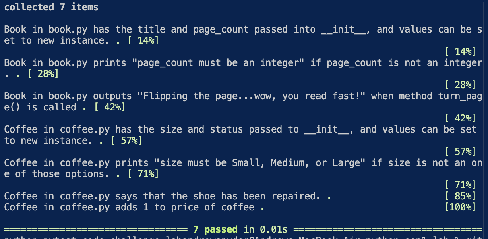
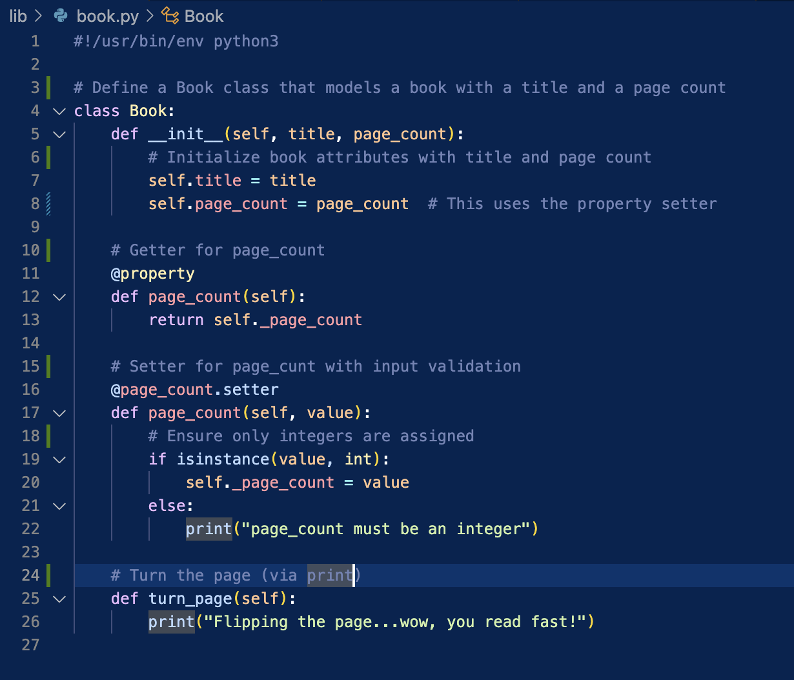
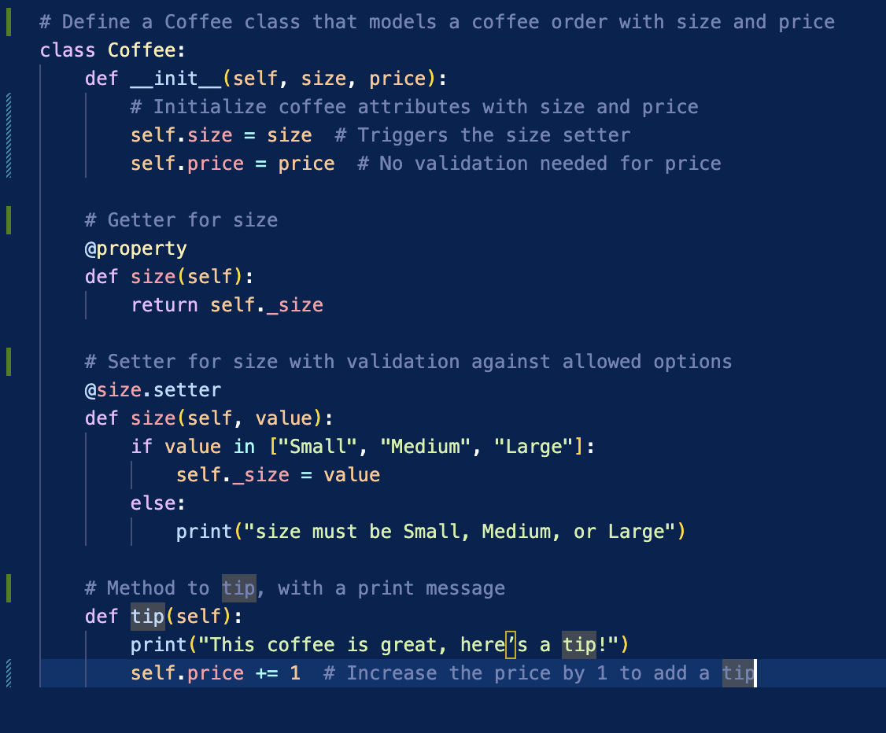

# Object Oriented Programming Lab - Bookstore

This scenario should encompass all of the topics provided in the module. Now that you’ve delved into creating a new class in Python it is now time to practice this concept.

## The Scenario

You are tasked with building two different classes to aid with representing and modeling a bookstore. First will be a book object to allow for reading an online book and the second will be a coffee object as another object carried by the store. Both objects will have several attributes and functions to be called.

# Python OOP1 Lab: Book and Coffee Classes

## Overview

This lab demonstrates fundamental object-oriented programming principles in Python. We created two custom classes: `Book` and `Coffee`, each with their own attributes, property setters, and instance methods.

## Features

### Book Class

- **Attributes**:
  - `title` (string)
  - `page_count` (integer with validation)
- **Methods**:
  - `turn_page()` prints a message indicating the page is being flipped.
- **Validation**:
  - Ensures `page_count` is an integer, otherwise prints an error message.

### Coffee Class

- **Attributes**:
  - `size` (must be "Small", "Medium", or "Large")
  - `price` (float)
- **Methods**:
  - `tip()` prints a message and increases the price by 1.
- **Validation**:
  - Ensures `size` is one of the allowed options.

## Screenshots

## Tools & Resources

- [GitHub Repo](https://github.com/learn-co-curriculum/python-oop1-lab)
- [Python Classes](https://docs.python.org/3/tutorial/classes.html)

## Instructions

### Set Up

Before we begin coding, let's complete the initial setup for this lesson:

- Part 1: Fork and Clone- For this lesson, you will need the previously linked GitHub Repo:
  - Go to the provided GitHub repository link.
  - Fork the repository to your GitHub account.
  - Clone the forked repository to your local machine.
- Part 2: Open and Run File
  - Open the project in VSCode.
  - Run npm install to install all necessary dependencies.

### Task 1: Define the Problem

Build a model for a book and a coffee
 
As a user, one should be able to:

- Build a book object
- Build a coffee object
- Call to turn a book page
- Call to tip for the coffee

### Task 2: Determine the Design

Book

- Attributes:
  - title
  - page_Count
- Methods:
  - turn_page()
    Coffee
- Attributes:
  - size
  - price
- Methods:
  - tip()

### Task 3: Develop, Test, and Refine the Code

#### Step 1: Feature Branch and Book Class

- Create Feature Branch

- Create Book class:
  - **init**:
    - title
      - Require user to input
    - page_count
      - Require user to input
- Properties:
  - page_count:
    - Ensure it is an integer
    - if not print “page_count must be an integer”
- Methods:
  - turn_page():
    - Will print “Flipping the page...wow, you read fast!”

#### Step 2: Create Coffee Class & Push Feature Branch and Merge

- **init**:
  - size
    - Require user to input
  - price
    - Require user to input
- Properties:
  - Size
    - Ensure size is either Small, Medium, or Large
    - If not print “size must be Small, Medium, or Large”
- Methods:
  - tip():
    - Will print “This coffee is great, here’s a tip!”
    - Will increase price by 1

#### Step 3: Push Feature Branch and Merge

- Push feature branch and open a PR on GitHub
- Merge to main

### Task 4: Document and Maintain

Best Practice documentation steps:

- Add comments to code to explain purpose and logic. This clarifies intent / functionality of code to other developers
- Add screenshot of completed work included in Markdown in README.
- Update README text to reflect the functionality of the application following https://makeareadme.com.
- Delete any stale branches on GitHub
- Remove unnecessary/commented out code
- If needed, update git ignore to remove sensitive data

## Save your work and push to GitHub

Before you submit your solution, you need to save your progress with git.

1. Add your changes to the staging area by executing git add .
2. Create a commit by executing git commit -m "Your commit message"
3. Push your commits to GitHub by executing git push origin main or git push origin master , depending on the name of your branch (use git branch to check on which branch you are).

## Submission and Grading Criteria

1. Use the rubric in Canvas as a guide for how this lab is graded.
2. Your submission will be automatically scored in CodeGrade, using the most recent commit. Remember to make sure you have pushed your commit to GitHub before submitting your assignment.
3. You can review your submission in CodeGrade and see your final score in your Canvas gradebook.
4. When you are ready to submit, click the **_Load Lab: Object Oriented Programming (OOP)- Part 1- Bookstore_** button in Canvas to launch CodeGrade.

- Click on + Create Submission. Connect your repository for this lab.
- For additional information on submitting assignments in CodeGrade: [Getting Started in Canvas](https://help.codegrade.com/for-students/getting-started/getting-started-in-canvas)
